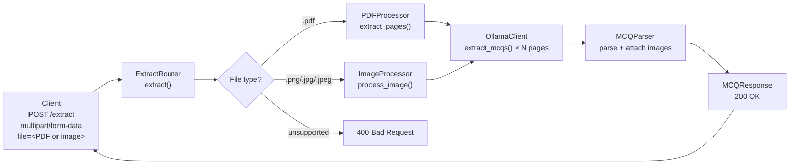
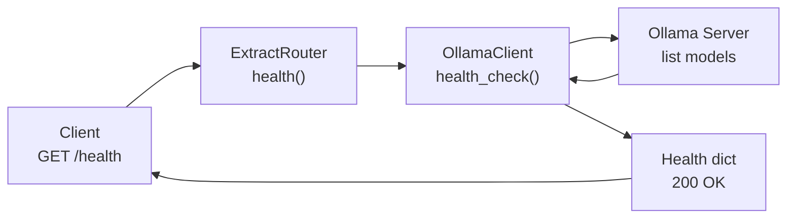
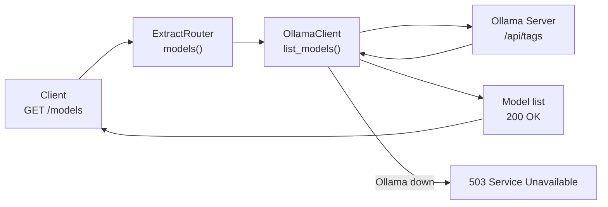

# API Endpoints

Base URL: `http://localhost:8000`

Interactive docs available at `/docs` (Swagger UI) and `/redoc`.

## Endpoint Summary

| Method | Path | Description |
|--------|------|-------------|
| `POST` | `/extract` | Upload a PDF or image and extract MCQs |
| `GET` | `/health` | Check Ollama and model availability |
| `GET` | `/models` | List available Ollama models |

---

## POST /extract

Extract multiple-choice questions from an uploaded file.



### Request
- **Content-Type**: `multipart/form-data`
- **Field**: `file` — PDF, PNG, JPG, or JPEG file

### Response `200 OK`
```json
{
  "source_file": "exam.pdf",
  "total_pages": 3,
  "total_questions": 12,
  "processing_time_ms": 18400,
  "questions": [
    {
      "question_number": 1,
      "page": 1,
      "question_text": "Which of the following is a primary color?",
      "has_image": false,
      "image": null,
      "options": {
        "A": "Green",
        "B": "Orange",
        "C": "Blue",
        "D": "Purple"
      },
      "answer": "C",
      "confidence": "high"
    }
  ]
}
```

### Response `400 Bad Request`
```json
{
  "detail": "Unsupported file type: .txt"
}
```

### Response `500 Internal Server Error`
```json
{
  "detail": "Processing failed: <error message>"
}
```

---

## GET /health

Check whether Ollama is reachable and the configured model is loaded.



### Response `200 OK` (healthy)
```json
{
  "ollama": "ok",
  "model": "gemma4:e4b",
  "model_available": true,
  "available_models": ["gemma4:e4b"]
}
```

### Response `200 OK` (Ollama unreachable)
```json
{
  "ollama": "error",
  "model": "gemma4:e4b",
  "model_available": false,
  "available_models": [],
  "detail": "Connection refused"
}
```

---

## GET /models

List all models currently available in the Ollama instance.



### Response `200 OK`
```json
{
  "models": ["gemma4:e4b", "gemma4:e2b"]
}
```

### Response `503 Service Unavailable`
```json
{
  "detail": "Ollama service unavailable"
}
```
