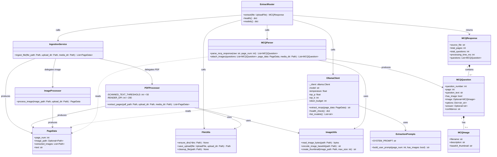

# Component Diagram

Class diagram of all modules, their responsibilities, and public interfaces.

## Module Responsibilities

| Module | Path | Responsibility |
|--------|------|---------------|
| `ExtractRouter` | `app/routers/extract.py` | HTTP endpoint handlers, orchestration, error handling |
| `IngestionService` | `app/services/ingestion.py` | Routes file to correct processor based on extension |
| `PDFProcessor` | `app/services/pdf_processor.py` | Opens PDF, detects scanned pages, renders PNGs, extracts embedded images |
| `ImageProcessor` | `app/services/image_processor.py` | Wraps a single image file as a one-page `PageData` |
| `OllamaClient` | `app/services/ollama_client.py` | Sends page images + prompt to Gemma 4, returns raw JSON |
| `MCQParser` | `app/services/mcq_parser.py` | Parses and validates Gemma 4 JSON output, attaches image thumbnails |
| `FileUtils` | `app/utils/file_utils.py` | Directory creation, upload saving, temp file cleanup |
| `ImageUtils` | `app/utils/image_utils.py` | Image byte reading, base64 encoding, thumbnail generation |
| `ExtractionPrompts` | `app/prompts/extraction.py` | System and user prompt templates for MCQ extraction |
