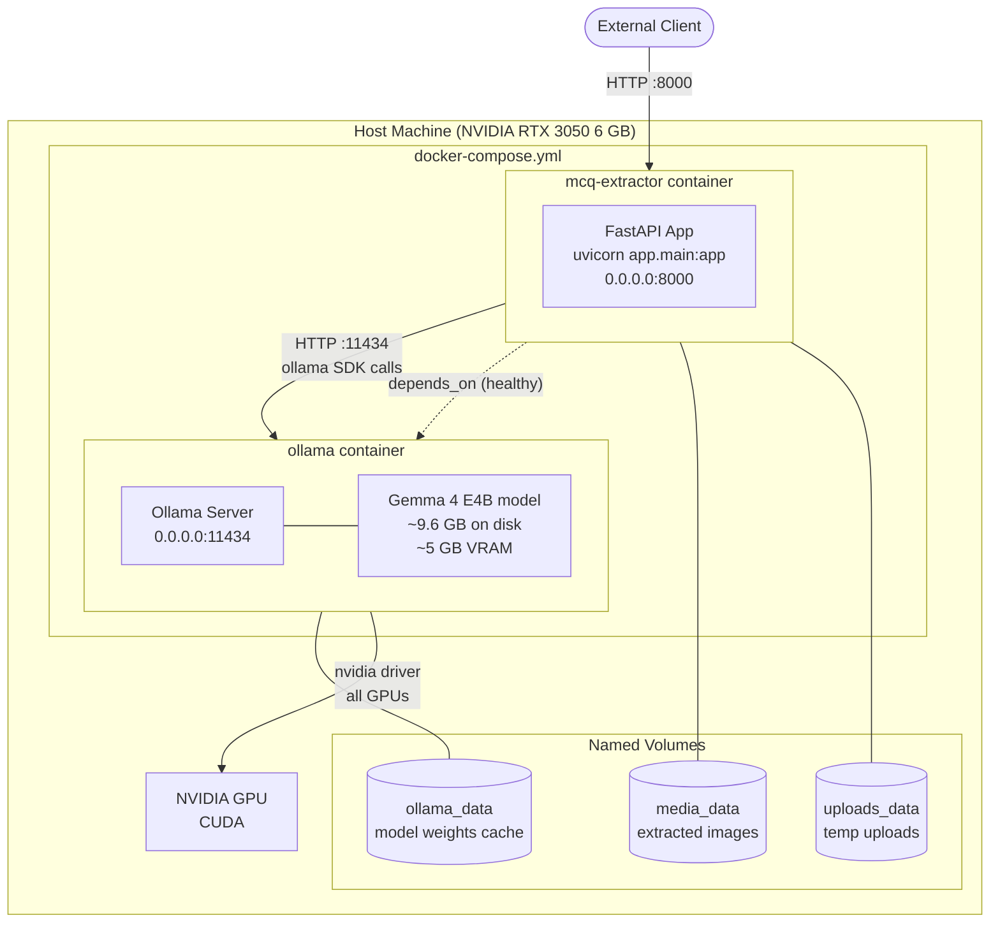

# Deployment Topology

Docker Compose layout showing containers, ports, volumes, and dependencies.

## Service Configuration

### `mcq-extractor`
| Setting | Value |
|---------|-------|
| Build context | `.` (local Dockerfile) |
| Base image | `python:3.11-slim` |
| Exposed port | `8000` |
| Env file | `.env` |
| Depends on | `ollama` (health check passes) |
| Volumes | `media_data:/app/media`, `uploads_data:/app/uploads` |

### `ollama`
| Setting | Value |
|---------|-------|
| Image | `ollama/ollama:latest` |
| Exposed port | `11434` |
| GPU | All NVIDIA GPUs (nvidia driver) |
| Volume | `ollama_data:/root/.ollama` |
| Health check | `curl -f http://localhost:11434/api/tags` |

## Environment Variables (`.env`)

| Variable | Default | Purpose |
|----------|---------|---------|
| `OLLAMA_HOST` | `http://localhost:11434` | Ollama server URL |
| `MODEL_NAME` | `gemma4:e4b` | LLM model identifier |
| `TEMPERATURE` | `1.0` | Sampling temperature |
| `TOP_P` | `0.95` | Nucleus sampling |
| `TOP_K` | `64` | Top-k sampling |
| `TOKEN_BUDGET` | `1120` | Max token context for OCR |
| `MAX_RETRIES` | `2` | Retry attempts on JSON parse failure |
| `MEDIA_DIR` | `media` | Extracted images directory |
| `UPLOAD_DIR` | `uploads` | Temporary uploads directory |
