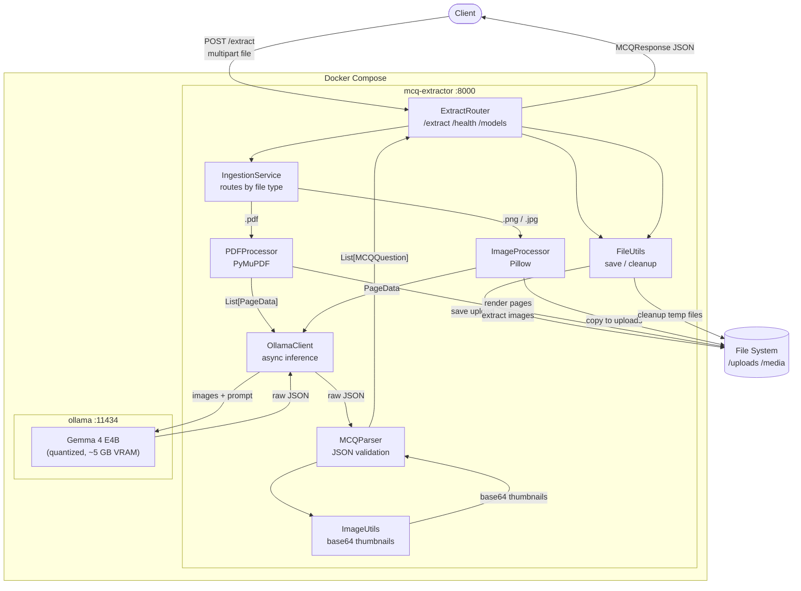

# System Architecture Overview

High-level view of the full request pipeline from client upload to MCQ JSON response.

## Key Design Decisions

| Decision | Rationale |
|----------|-----------|
| Sequential page processing | Avoids VRAM overflow — one page in VRAM at a time |
| Scanned PDF detection | Text layer < 50 chars triggers full-page image render |
| Images sent before text | Gemma 4 best practice for multimodal accuracy |
| Retry on parse failure | Up to `MAX_RETRIES` (default 2) if Gemma 4 returns malformed JSON |
| Skip malformed questions | Partial extraction is better than a total page failure |
| Async executor pattern | Ollama Python SDK is synchronous; wrapped in `run_in_executor` to not block FastAPI event loop |
