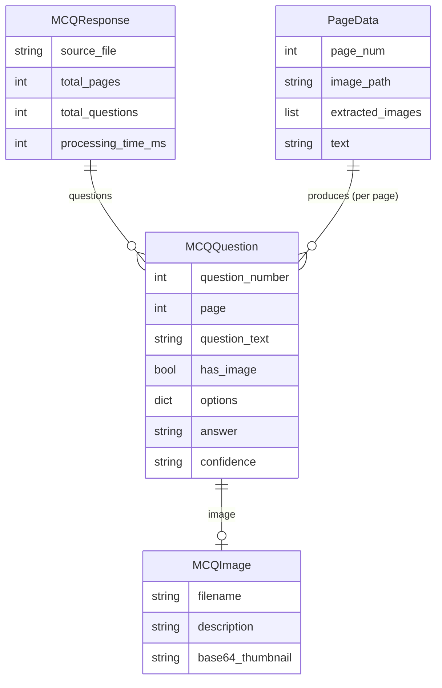

# Entity Relationship Diagram

Relationships between Pydantic data models (`app/models/schemas.py`) and internal processing types.

## Model Details

### `MCQResponse` — API response root
The top-level object returned by `POST /extract`. Aggregates all questions across all pages.

| Field | Type | Description |
|-------|------|-------------|
| `source_file` | `str` | Original uploaded filename |
| `total_pages` | `int` | Number of pages processed |
| `total_questions` | `int` | Total MCQs extracted |
| `processing_time_ms` | `int` | Wall-clock time in milliseconds |
| `questions` | `List[MCQQuestion]` | All extracted questions |

### `MCQQuestion` — Single extracted question
One multiple-choice question extracted from a page.

| Field | Type | Description |
|-------|------|-------------|
| `question_number` | `int` | Sequential question number |
| `page` | `int` | Source page number |
| `question_text` | `str` | Full question text |
| `has_image` | `bool` | Whether question references an image |
| `image` | `Optional[MCQImage]` | Associated image, if any |
| `options` | `Dict[str, str]` | Answer options, e.g. `{"A": "...", "B": "..."}` |
| `answer` | `Optional[str]` | Correct answer letter, or `null` if unknown |
| `confidence` | `str` | Extraction confidence: `"high"`, `"medium"`, or `"low"` |

### `MCQImage` — Image embedded in a question
A thumbnail of an image associated with a question.

| Field | Type | Description |
|-------|------|-------------|
| `filename` | `str` | Source image filename |
| `description` | `str` | Text description (may be empty) |
| `base64_thumbnail` | `str` | Base64-encoded PNG thumbnail (max 200×200 px) |

### `PageData` — Internal processing unit
Used internally during extraction. Not returned in API responses.

| Field | Type | Description |
|-------|------|-------------|
| `page_num` | `int` | Page index (1-based) |
| `image_path` | `Optional[Path]` | Path to full-page PNG render |
| `extracted_images` | `List[Path]` | Paths to embedded images extracted from the page |
| `text` | `str` | Text layer content (empty for scanned pages) |

## Confidence Levels

| Value | Meaning |
|-------|---------|
| `"high"` | Gemma 4 is confident in the extraction |
| `"medium"` | Some ambiguity in the source material |
| `"low"` | Low quality scan or partial question visible |
