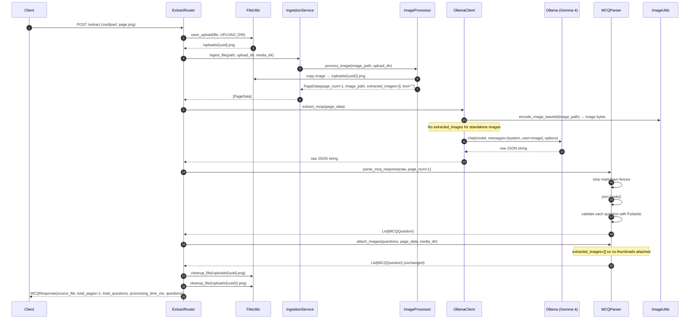

# Sequence Diagram: POST /extract (Image)

Flow when a client uploads a standalone image file (PNG, JPG, JPEG).

## Differences from PDF Flow

| Aspect | PDF | Image |
|--------|-----|-------|
| Pages | Multiple | Always 1 |
| Page rendering | PyMuPDF → 200 DPI PNG | File used as-is |
| Embedded image extraction | Yes (non-scanned) | No |
| Image thumbnails in response | Possible | Not applicable |
| Temp files created | Page PNGs + upload | Upload copy only |
| Scanned detection | Yes | N/A (already an image) |
