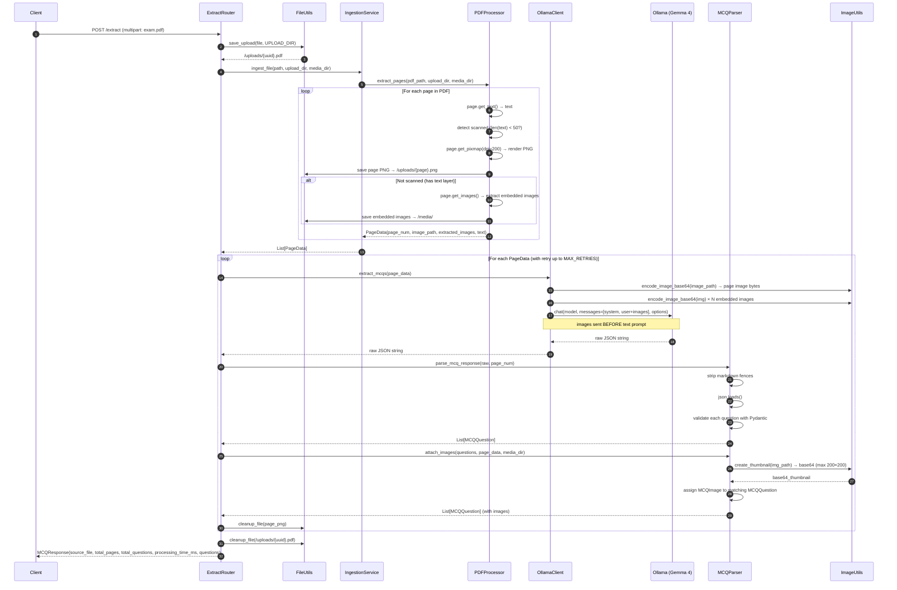

# Sequence Diagram: POST /extract (PDF)

Full end-to-end flow when a client uploads a PDF file.

## Notes

- **Scanned PDF**: If a page has fewer than 50 characters of text, it is treated as a scanned image. Only the full-page PNG is sent; no embedded image extraction is attempted.
- **Text-based PDF**: Both the rendered page PNG and any embedded images are extracted and sent to Gemma 4.
- **Retry logic**: If `parse_mcq_response` raises a `ValueError` (bad JSON), the `extract_mcqs` + parse cycle is retried up to `MAX_RETRIES` times for that page.
- **Partial failure**: If a question within a page fails Pydantic validation, it is skipped silently rather than failing the entire page.
- **Async**: `OllamaClient.extract_mcqs()` is `async` and uses `run_in_executor` to call the synchronous Ollama SDK without blocking FastAPI's event loop.
