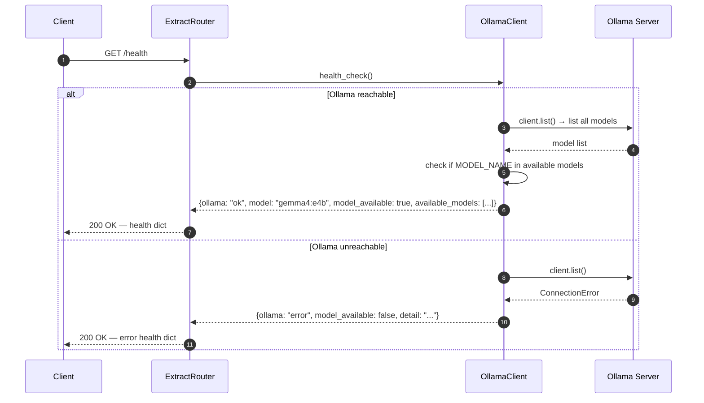
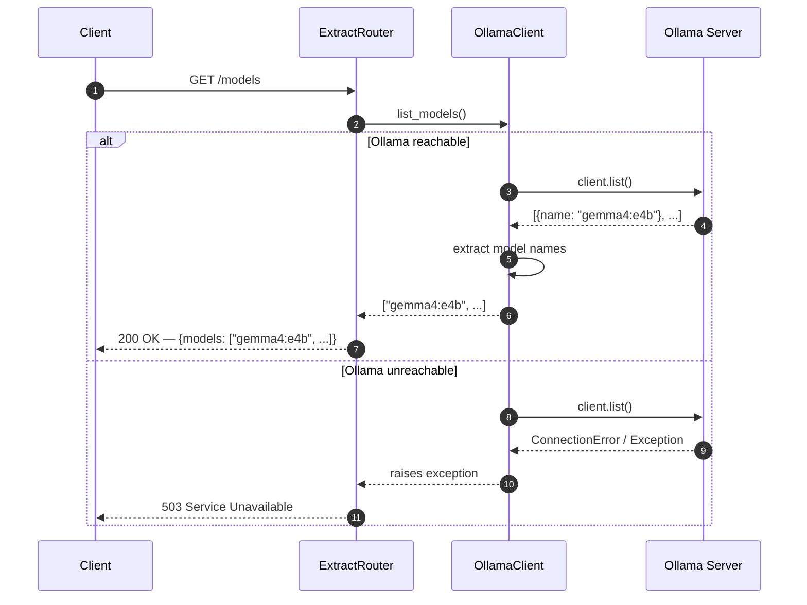

# Sequence Diagrams: GET /health and GET /models

## GET /health

Verifies that the Ollama server is reachable and the configured model is loaded.

---

## GET /models

Lists all models currently available in the Ollama instance.

## Response Comparison

| Endpoint | Success | Failure |
|----------|---------|---------|
| `GET /health` | Always `200` — health status in body indicates ok/error | `200` with `ollama: "error"` |
| `GET /models` | `200` with models list | `503 Service Unavailable` |
